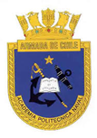

<header>

</header>

     

# Práctica Universitaria - Apolinav (Febrero - Abril 2024)

Repositorio con la documentación y archivos de la práctica universitaria realizada en la **Apolinav** entre febrero y abril de 2024.

## Contenido
- **Informe_Apolinav.pdf** → Análisis estadístico del rendimiento académico (2007-2023) en cursos de Ingeniería Naval y Eléctrica.
- **dist.zip** → Herramienta que utiliza **caras de Chernoff** para representar y clasificar el rendimiento de nuevos alumnos, detectando si podrían requerir apoyo académico.  
  🔗 [Descargar aplicación desde Google Drive](https://drive.google.com/file/d/1Ckyb1Yi_YiUeyX2TmsUD4SAdKoez5FVa/view?usp=sharing)

---

**Autor:** Benjamín Antonio Acuña Azocar  
**Carrera:** Ingeniería Civil Matemáticas – UTFSM  
**Período:** Febrero - Abril 2024
